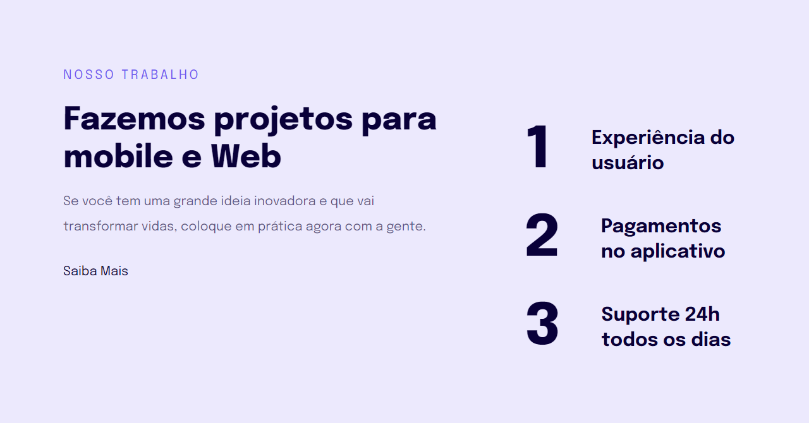

# Projeto 04: Responsividade

### Desktop

### Mobile

### Acesse o projeto: [Aqui](https://jonasncsantos.github.io/Crie-seu-evento/)

## Sobre
Projeto desenvolvido durante aula para aplicação dos conhecimentos ensinados no curso Explorer da [Rocketseat](https://www.rocketseat.com.br/") no Stage 03.

## Aprendizados
- Mobile-first
- Unidade de medidas flexiveis (rem/em)
- Media Queries